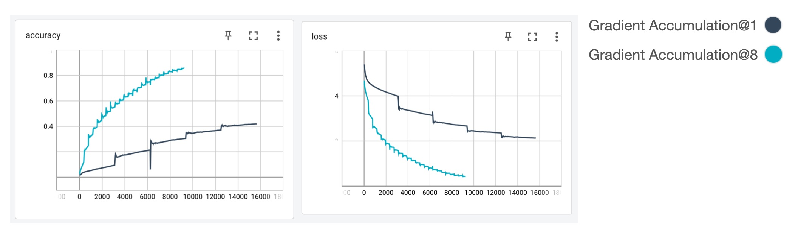

## How To Use
See [custom_model.py](custom_model.py) and [train.py](train.py)  for details.  

```python
#
# Define your model via subclassing. ---|
#                                       |
#                                      \/
class CustomClassifier(GradientAccumulatorModel):

    def __init__(self, num_grad_accum=1, **kargs):
        #
        # How many accumulate do you want?
        # Pass that accumulation counts to GradientAccumulatorModel class.
        #
        super(CustomClassifier, self).__init__(num_accum=num_grad_accum, **kargs)
        #
        # Implements your neural networks.
        #

    def compile(self, **kargs):
        #
        # You should call compile function to build accumulator and neural networks.
        #
        super(CustomClassifier, self).compile(**kargs)

    def call(self, inputs, training=False):
        #
        # Implements your Forward pass.
        #

    def train_step(self, data):
        x, y_true = data
        with tf.GradientTape() as tape:
            #
            # Implements your custom training loop.
            #
            total_loss = tf.math.reduce_mean(your_loss)
        grads = tape.gradient(total_loss, self.trainable_variables)
        #
        # Just feed your gradients. -------|
        #                                  |
        #                                 \/
        self.accumulate_grads_and_apply(grads)
        return {'loss': total_loss}
```

## Example on Cifar100 Dataset
```
python train.py --batch 16 --grad_accum 8
```

## Results
Batch size is 16.  



## References
1. [stackoverflow: how-to-accumulate-gradients-in-tensorflow-2-0](https://stackoverflow.com/questions/59893850/how-to-accumulate-gradients-in-tensorflow-2-0)
